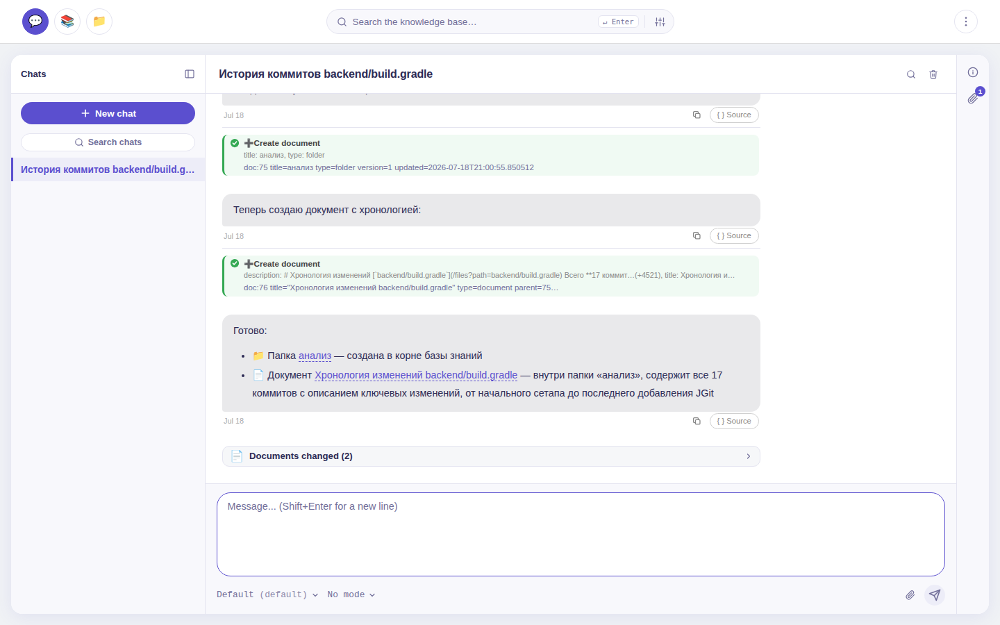
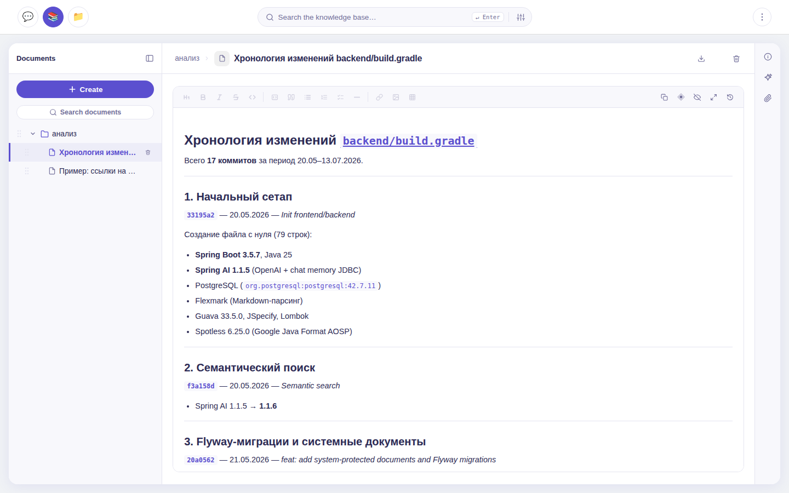

# Knowledge Base

AI-ассистент для работы с Git-репозиторием: поиск по коду и истории изменений,
ответы на вопросы о проекте и база знаний, которая живёт рядом с кодом.

## Что это

Вы указываете путь к локальному Git-репозиторию (нужен установленный `git`) —
и получаете веб-приложение, в котором AI-чат отвечает на вопросы о коде,
коммитах и архитектуре на естественном языке, а результаты работы оседают
в структурированной базе знаний.

Knowledge Base — не терминальный агент. Модель не выполняет команды: она
читает репозиторий через фиксированный набор инструментов — файлы, коммиты,
диффы, grep, структурный анализ — и работает строго внутри указанного
каталога, видя только файлы под контролем Git (`.env`, `node_modules` и всё
из `.gitignore` для неё не существуют). Правка кода доступна, но выключена
по умолчанию и включается явным флагом; сборку и тесты вы запускаете сами —
пока что.

Основной сценарий — **поиск информации и накопление знаний о проекте**:
онбординг в незнакомый код, разбор истории изменений, документация, которая
не расходится с кодом.

<p align="center">
  
  
</p>

## Что умеет

### Поиск и анализ репозитория

- 🤖 **AI-чат по коду** — вопросы о файлах, коммитах и архитектуре на
  естественном языке; готовые режимы (Аналитик / Разработчик / Тестировщик)
  и выбор модели
- 🐙 **Git-анализ** — чтение файлов, история коммитов, диффы, grep по
  репозиторию, структурный анализ кода (tree-sitter)
- 📂 **Панель «Файлы»** — просмотр репозитория (дерево, содержимое, последний
  коммит) в GitHub-стиле, вставка файлов в чат
- 🔍 **Гибридный поиск** — keyword + смысловой (векторный), по базе знаний
  и по чатам

### База знаний

- 📁 **Дерево документов** — папки и документы с древовидной структурой
- ✏️ **Markdown-редактор** — создание и редактирование с живым предпросмотром
- 🕘 **История версий** — diff изменений и восстановление предыдущих состояний
- ✨ **AI-саммаризация** — автоматические краткие описания документов
- 📎 **Вложения** — загрузка файлов к документам и чатам
- 📤 **Экспорт и импорт** — обмен базой знаний с файловой системой

### Правка кода — опционально

- 🔒 **Выключена по умолчанию** — включается флагом `kb.git.edit-enabled`
- ✍️ **Создание и правка файлов** рабочего дерева — только внутри репозитория
- 🚫 **Без запуска команд** — модель не получает shell; сборки и тесты
  запускаете сами (пока что)

### Интеграции и развёртывание

- 🔌 **Любой OpenAI-совместимый API** — в том числе локальные модели:
  код может не покидать вашу машину
- 🧩 **MCP** — подключение внешних инструментов через MCP-серверы
  (выключено по умолчанию)
- 🐳 **Docker** — готовый compose-файл для быстрого развёртывания
- ⚙️ **Администрирование** — снимки конфигурации AI/поиска, библиотека фраз,
  переиндексация, информация о системе

## Быстрый старт

Понадобятся: установленный `git`, репозиторий для анализа и ключ любого
OpenAI-совместимого API.

```bash
cd docker
cp example.env .env
# Укажите AI_API_KEY, AI_BASE_URL, AI_MODEL и PROJECT_PATH_MOUNT
docker compose -f docker-compose-h2.yaml up
```

Открывайте http://localhost:8080 — логин/пароль по умолчанию `admin` / `admin`
(смените в настройках, если приложение доступно не только с localhost).

> Этот вариант использует встроенную H2 — PostgreSQL не нужен. Для полного
> стека с семантическим поиском запускайте `docker compose up` и добавьте
> в `.env` переменные `AI_EMBED_*`.

Без Docker (нужен JDK 25): соберите JAR и запустите скриптом из `run/` —

```bash
./gradlew :backend:bootJar
# Отредактируйте run/application.yaml: api-key, base-url, модель,
# kb.git.project-path (путь к репозиторию для анализа)
./run/run.sh
```

Пошаговая инструкция для обоих вариантов, профили и Windows-скрипты —
[Руководство по установке](docs/проект/руководство-по-установке.md).

## Документация

Начните с [Введения](docs/проект/введение.md) — там обзор возможностей и
полное оглавление. Ключевые документы:

| Документ | О чём |
|---|---|
| [Архитектура](docs/проект/архитектура.md) | Схема слоёв, стек технологий, сервисы |
| [AI-инструменты](docs/проект/ai-инструменты.md) | Все инструменты ассистента и их параметры |
| [Конфигурация](docs/проект/конфигурация.md) | Переменные окружения, Docker, настройки |
| [Руководство по установке](docs/проект/руководство-по-установке.md) | Требования, запуск, устранение проблем |
| [Чат — руководство пользователя](docs/features/чат-руководство-пользователя.md) | Как пользоваться чатом |
| [База знаний — руководство пользователя](docs/features/база-знаний-руководство-пользователя.md) | Навигация, поиск, AI-саммаризация |
| [Разработка и контрибьюция](docs/проект/разработка-и-контрибьюция.md) | Сборка, тестирование, стиль кода |

## Стек технологий

| Компонент | Технологии |
|---|---|
| Бэкенд | Java 25, Spring Boot 4.1, Spring AI, PostgreSQL 17 + pgvector |
| Фронтенд | React 19, CSS |
| Инфраструктура | Docker, docker-compose |

Подробно — [Архитектура](docs/проект/архитектура.md)
